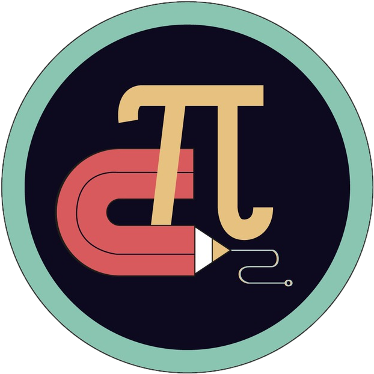

Hoy inicia el reto de Platzi Math Academy, un esfuerzo de la comunidad de Platzi para lograr enseñar matemáticas y que muchas personas como yo rompan el hielo con esta gran e importante herramienta, o ciencia.

Durante todo mi proceso de aprendizaje usaré mi blog personal, aquí iré dejando mis logros, mis derrotas, mis anhelos, mis frustraciones, pero creo que aún más importante, dejaré guías de lo que he ido aprendiendo.

Como dice la profesora del [Curso de Estrategias para Aprender en Línea Efectivamente](https://platzi.com/cursos/aprender/) la mejor forma de saber que sabes, es enseñando. Entonces, en ese orden de idas, mi intención es también ir compartiendo conocimiento en esta bitácora.

Por el momento, el primer reto de esta semana es tomar el [Curso de Pensamiento Lógico](https://platzi.com/clases/pensamiento-logico/). ¡Les contaré que aprendí y como me fue!

[Ver uso de notación matematica](/uso-notacion-matematica/)
